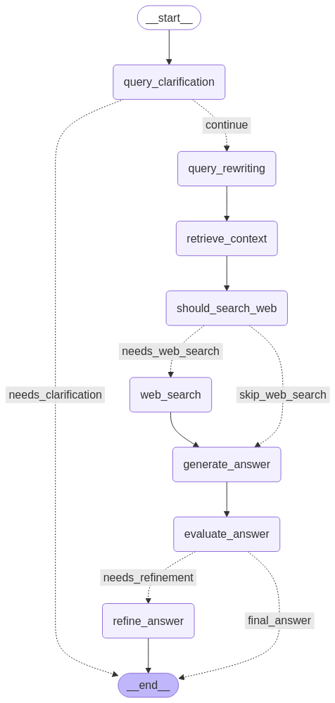
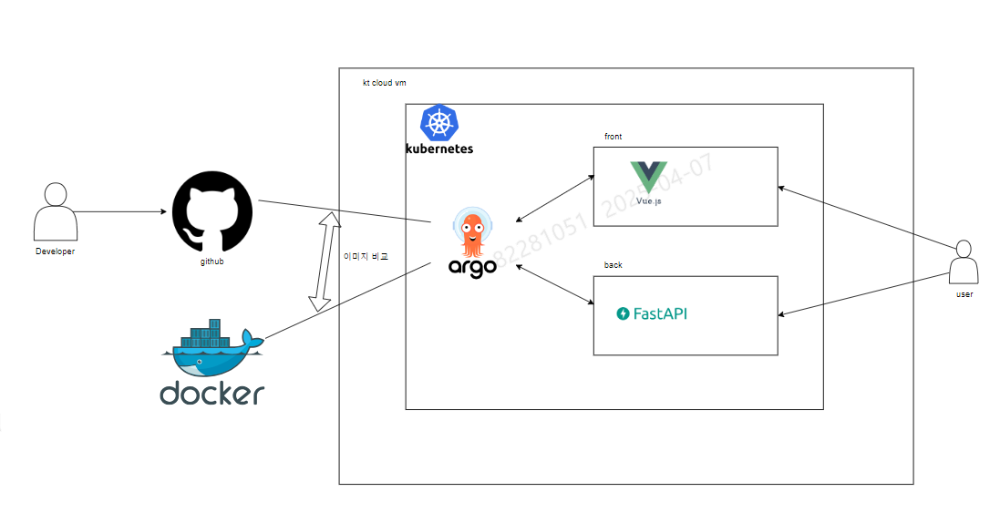

# UMS API 챗봇 백엔드 서버

KT-UMS OPEN API 연동규격 문서를 바탕으로 
사용자 질문에 답변하는 챗봇 서비스의 백엔드 서버


## 프로젝트 구조

```
BACK_END/
├── main.py                # FastAPI 메인 애플리케이션
├── config.py              # 환경 설정 및 상수
│
├── document_loader/       # 문서 처리 관련 컴포넌트
│   ├── util.py            # 문서 로드 및 문서 분할
│   └── loader.py          # 문서 -> 벡터DB
│
├── vector_db/             # 벡터DB
│   ├── index.faiss        # 벡터 index data
│   └── index.pkl          # 문서 deserialized data
│
├── agent/                 # 에이전트
│   ├── evaluator.py       # 답변 품질 측정
│   └── tools.py           # 인터넷 검색 도구
│
├── graph/                 # 그래프
│   ├── nodes.py           # LangGraph 노드 정의
│   ├── edges.py           # LangGraph 엣지 정의
│   └── graph.py           # LangGraph 그래프 및 상태 구성
│
├── prompts/
│   ├── system.py          # 프롬프트
│   └── templates.py       # 각 노드별 프롬프트 템플릿
│
├── utils/
│   └── helpers.py         # 로깅 및 요청/응답 포맷
│
├── data/
│   └── KT-UMS OPEN API 연동규격_v1.07.docx  # 문서
│
│
├── kt_ums_chatbot.log     # 요청 처리 로그 저장
├── chat_graph.png         # 생성한 LangGraph 구조, 서버 가동시 자동 생성
├── .env                   # 환경 변수 파일
├── requirements.txt       # 필요한 패키지 목록
└── README.md              # 프로젝트 설명
```

## 랭그래프 구조


## 주요 기술 스택
langgraph
fastapi
FAISS

### 질문 처리

**POST /question**

요청 형식:
```json
{
  "query": "KT-UMS API 연동 방법은 어떻게 되나요?"
}
```

응답 형식:
```json
{
  "answer": "KT-UMS API 연동을 위해서는...",
  "metadata": {
    "original_query": "KT-UMS API 연동 방법은 어떻게 되나요?",
    "rewritten_query": "KT-UMS OPEN API 연동을 위한 구체적인 방법과 필요한 파라미터는 무엇인가요?",
    "processing_time": "2.45s",
    "hallucination_score": 1.5,
    "reliability_score": 8.7,
    "answer_source": "document",
    "internet_search_used": false
  }
}
```

인터넷 검색을 사용한 경우:
```json
{
  "answer": "JSON(JavaScript Object Notation)은 데이터를 교환하기 위한 경량 포맷으로...",
  "metadata": {
    "original_query": "JSON이 뭐야?",
    "rewritten_query": "JSON(JavaScript Object Notation)이란 무엇인가요?",
    "processing_time": "4.32s",
    "hallucination_score": 1.0,
    "reliability_score": 9.2,
    "answer_source": "combined",
    "internet_search_used": true,
    "search_reason": "질문에 일반 기술 개념 키워드가 포함됨",
    "search_query": "JSON 정의 특징 사용 사례",
    "doc_relevance_score": 3.5
  }
}
```

## 특이사항

## 문서
- UnstructuredWordDocumentLoader를 통한 docx 로드
- RecursiveCharacterTextSplitter을 통한 문서 분할
- OpenAI, FAISS를 통한 문서 임베딩 및 벡터DB 생성
- 벡터DB를 로컬에 저장하여 서버 재기동시 추가 작업 없이 빠르게 가동

## 서버
- 서버 생성시 랭그래프 초기화 및 LangGraph 구조를 png파일로 저장
- 서버에서 요청 처리시 로그 출력 및 파일로 저장
- cicd등 장점 자유롭게 추가 해 주시면 됩니다.

## RAG
- LangGraph를 통한 확장성 증대
- LanGraph 내의 쿼리 재작성, 인터넷 검색 에이전트, 답변 품질 측정 등 다양한 노드 개발

## 역할
홍문기 선임
- 문서 파싱 모듈 구현
- 청킹 전략 구현 및 최적화
- 인덱싱 시스템 구현
- 임베딩 생성 및 저장 로직 개발

김지희 전임
- RAG 응답 생성 시스템 구현
- 문서 관련성 평가 로직 구현
- 할루시네이션 검출 모듈 개발
- 응답 품질 측정 시스템 개발
- 응답 캐싱 매커니즘 구현

류호원 전임
- backend/frontend 전체 배포 환경 구성
- CI/CD 파이프라인 설정
- 시스템 로깅 구축

고재원 전임
- LLM 프롬프트 엔지니어링
- 쿼리 분석/재작성 모듈 구현
- 웹 검색 통합 모듈 구현
- LangGraph 라우팅 구현

## CI/CD 파이프라인




o CI

o github + git action 사용
github 주소 : https://github.com/ums-api-ai-chatbot/back-end

1. git action trigger 조건 : main 브랜치에 push || pr
2. git action 이 소스코드를 docker image로 말아서 image push 진행
3. image push 하면서 해당 이미지에 태그를 할당
4. 할당된 태그로 deployment.yaml 에 선언된 사용 이미지의 태그 변경

o CD

o kubernetes(k3s) + argocd 사용

서버 주소(kt cloud vm) : 211.254.213.18
argo cd 주소 : http://211.254.213.18:30518
vue 페이지 주소 (front-end) : http://211.254.213.18:32767
fastapi 페이지 주소 (back-end) : http://211.254.213.18:30000

1. k3s로 서버의 전체 pod를 관리합니다.
2. argo cd pod가 git repo의 deployment.yaml을 바라보며 vue ns의 pod 및 fastapi ns의 pod 를 관리 합니다.
3. ci 4번으로 소스코드가 변경되면 argo가 관리하는 pod의 이미지(기존)와 새로운 소스코드의 이미지의 태그가 달라지게 됩니다.
4. argo cd 는 달라진 이미지 태그를 감지하여 out of sync 상태가 됩니다.
5. argo cd 에서 sync를 맟춰주면 관리하는 pod 에서 새로운 이미지를 pull  받아 배포됩니다.

## 실행 방법

```bash
venv\Scripts\activate 
pip install -r requirements.txt
uvicorn main:app --reload --host 0.0.0.0 --port 8000
```

## 개선 POINT
### 속도
- 답변 캐싱을 통한 응답 속도 향상
- docx -> markdown 변환 및 청킹 단위 조절을 통한 검색 속도 향상
- 스트리밍 처리를 통한 응답 지연 시간 감소
  
### 정확도
- 엔트로픽/openai 프롬프트 엔지니어링을 통한 답변 정확도 향상
- 쿼리 재작성을 통한 답변 정확도 향상


## 기타


답변 캐싱
파라미터에 대한 자세한 옵션
파생 질문 다양화

## 라이선스
Apache-2.0 license
